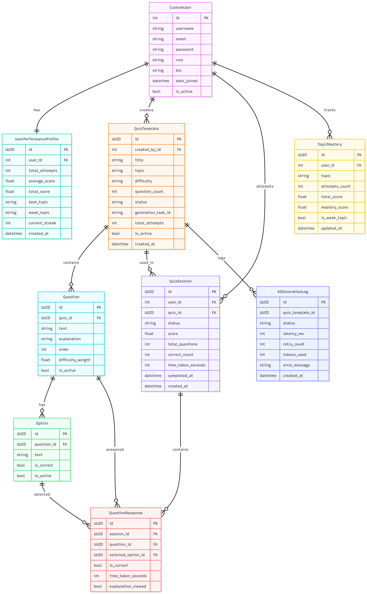

# 🎯 AI-Powered Quiz API

A production-grade REST API for an AI-powered quiz platform built with Django and PostgreSQL. The platform supports dynamic quiz generation using Google Gemini AI, role-based access control, adaptive analytics, and a unique explanation mode that turns wrong answers into learning opportunities.

---

## 🔗 Live Links

| Resource | URL |
|---|---|
| **Live API** | https://quiz-api-production-589c.up.railway.app |
| **Swagger Docs** | https://quiz-api-production-589c.up.railway.app/api/docs/ |
| **Admin Panel** | https://quiz-api-production-589c.up.railway.app/admin/ |
| **GitHub Repo** | https://github.com/PraneetAR/quiz-api |

---

## 🧰 Tech Stack

| Layer | Technology | Purpose |
|---|---|---|
| Framework | Django 4.2 + DRF | REST API |
| Database | PostgreSQL | Primary data store |
| Cache | Redis | Quiz caching + rate limiting |
| AI | Google Gemini 2.5 Flash | Quiz generation + explanations |
| Auth | JWT (simplejwt) | Stateless authentication |
| Docs | drf-spectacular | Auto Swagger UI |
| Deploy | Railway | Cloud hosting |
| Server | Gunicorn + Whitenoise | Production WSGI |

---

## 🏗️ Project Architecture

```
quiz_api/
│
├── apps/                          ← All Django applications
│   ├── __init__.py
│   │
│   ├── core/                      ← Shared base code used by all apps
│   │   ├── __init__.py
│   │   ├── apps.py
│   │   ├── models.py              ← BaseModel (UUID, timestamps, soft delete)
│   │   ├── exceptions.py          ← Custom exception handler + ServiceError
│   │   ├── pagination.py          ← Standard pagination response format
│   │   ├── throttles.py           ← QuizGenerationThrottle + LoginThrottle
│   │   └── admin.py
│   │
│   ├── users/                     ← Authentication and user management
│   │   ├── __init__.py
│   │   ├── apps.py
│   │   ├── models.py              ← CustomUser + UserPerformanceProfile
│   │   ├── serializers.py         ← Register, login, profile serializers
│   │   ├── services.py            ← register_user, login_user, logout_user
│   │   ├── views.py               ← Auth endpoints
│   │   ├── urls.py                ← Auth URL routing
│   │   ├── signals.py             ← Auto-create performance profile on register
│   │   └── admin.py               ← User admin with bulk actions
│   │
│   ├── quizzes/                   ← Quiz generation and management
│   │   ├── __init__.py
│   │   ├── apps.py
│   │   ├── models.py              ← QuizTemplate, Question, Option
│   │   ├── serializers.py         ← QuizTemplateSerializer, QuizGenerateSerializer
│   │   ├── services.py            ← get_or_generate_quiz, cache logic
│   │   ├── views.py               ← Generate, List, Detail, Delete, Mine
│   │   ├── urls.py                ← Quiz URL routing
│   │   └── admin.py               ← Quiz admin with inline questions
│   │
│   ├── attempts/                  ← Quiz attempt tracking and explanation
│   │   ├── __init__.py
│   │   ├── apps.py
│   │   ├── models.py              ← QuizSession, QuestionResponse
│   │   ├── serializers.py         ← Attempt, result, explanation serializers
│   │   ├── services.py            ← start, answer, submit, explain logic
│   │   ├── views.py               ← Start, Answer, Submit, Result, Explain
│   │   ├── urls.py                ← Attempt URL routing
│   │   └── admin.py               ← Session admin with inline responses
│   │
│   ├── analytics/                 ← Performance analytics and leaderboard
│   │   ├── __init__.py
│   │   ├── apps.py
│   │   ├── models.py              ← TopicMastery
│   │   ├── serializers.py         ← Dashboard, mastery, trend, leaderboard
│   │   ├── services.py            ← get_dashboard, get_leaderboard, get_trend
│   │   ├── views.py               ← Dashboard, Topics, Trend, Weak, Leaderboard
│   │   ├── urls.py                ← Analytics URL routing
│   │   └── admin.py               ← TopicMastery read-only admin
│   │
│   └── ai_service/                ← Isolated AI layer (Gemini integration)
│       ├── __init__.py
│       ├── apps.py
│       ├── models.py              ← AIGenerationLog (audit trail)
│       ├── client.py              ← GeminiClient with retry + logging
│       ├── prompt_builder.py      ← Quiz and explanation prompt templates
│       ├── validators.py          ← AI response validation + topic sanitizer
│       └── admin.py               ← Read-only AI log admin
│
├── config/                        ← Django project configuration
│   ├── __init__.py
│   ├── settings.py                ← All project settings
│   ├── urls.py                    ← Root URL router
│   ├── wsgi.py                    ← Production WSGI entry point
│   └── asgi.py                    ← ASGI entry point
│
├── docs/                          ← Project documentation
│   ├── Quiz_api_tests.postman_collection.json
│   └── Quiz API env.postman_environment.json
│
├── staticfiles/                   ← Collected static files (auto-generated)
│
├── manage.py                      ← Django management CLI
├── requirements.txt               ← Python dependencies
├── Procfile                       ← Railway/Heroku process definition
├── runtime.txt                    ← Python version for deployment
├── railway.json                   ← Railway deployment config
└── .env.example                   ← Environment variables template
```

---

## ⚙️ Local Setup

### Prerequisites
- Python 3.11+
- PostgreSQL
- Redis
- Git

### Step 1 — Clone the repository
```bash
git clone https://github.com/PraneetAR/quiz-api.git
cd quiz-api
```

### Step 2 — Create virtual environment
```bash
python -m venv venv

# Windows
venv\Scripts\activate

# Mac/Linux
source venv/bin/activate
```

### Step 3 — Install dependencies
```bash
pip install -r requirements.txt
```

### Step 4 — Set up environment variables
```bash
cp .env.example .env
```

Open `.env` and fill in your values:
```env
SECRET_KEY=your-secret-key-here
DEBUG=True
ALLOWED_HOSTS=localhost,127.0.0.1

DB_NAME=quiz_db
DB_USER=postgres
DB_PASSWORD=yourpassword
DB_HOST=localhost
DB_PORT=5432

REDIS_URL=redis://localhost:6379/0

GEMINI_API_KEY=your-gemini-api-key-here
```

### Step 5 — Create PostgreSQL database
```bash
psql -U postgres
CREATE DATABASE quiz_db;
\q
```

### Step 6 — Run migrations
```bash
python manage.py makemigrations
python manage.py migrate
```

### Step 7 — Create superuser
```bash
python manage.py createsuperuser
```

Then set admin role:
```bash
python manage.py shell
from apps.users.models import CustomUser
u = CustomUser.objects.get(username="your_username")
u.role = "admin"
u.save()
exit()
```

### Step 8 — Run the server
```bash
python manage.py runserver
```

API is now running at `http://127.0.0.1:8000`

---

## 🌍 Environment Variables

| Variable | Description | Required |
|---|---|---|
| `SECRET_KEY` | Django secret key | ✅ |
| `DEBUG` | True for dev, False for prod | ✅ |
| `ALLOWED_HOSTS` | Comma-separated allowed hosts | ✅ |
| `DB_NAME` | PostgreSQL database name | ✅ |
| `DB_USER` | PostgreSQL username | ✅ |
| `DB_PASSWORD` | PostgreSQL password | ✅ |
| `DB_HOST` | PostgreSQL host | ✅ |
| `DB_PORT` | PostgreSQL port (default 5432) | ✅ |
| `REDIS_URL` | Redis connection URL | ✅ |
| `GEMINI_API_KEY` | Google Gemini API key | ✅ |

---

## 🗄️ Database Schema

### Entity Relationship Diagram



### Models Overview

| Model | App | Description |
|---|---|---|
| `CustomUser` | users | Extended Django user with role field |
| `UserPerformanceProfile` | users | Auto-created performance stats per user |
| `QuizTemplate` | quizzes | AI-generated quiz with status tracking |
| `Question` | quizzes | Individual quiz question with ordering |
| `Option` | quizzes | Multiple choice option with correct flag |
| `QuizSession` | attempts | One attempt instance per user per quiz |
| `QuestionResponse` | attempts | Individual answer with time tracking |
| `TopicMastery` | analytics | Per-user per-topic performance score |
| `AIGenerationLog` | ai_service | Audit log for every Gemini API call |

### Key Relationships
```
CustomUser ──(1:1)── UserPerformanceProfile
CustomUser ──(1:N)── QuizTemplate (created_by)
CustomUser ──(1:N)── QuizSession
CustomUser ──(1:N)── TopicMastery
QuizTemplate ──(1:N)── Question
Question ──(1:N)── Option
QuizSession ──(1:N)── QuestionResponse
QuestionResponse ──(N:1)── Option (selected_option)
```

---

## 🔐 User Roles

| Role | Generate Quiz | Delete Own Quiz | Delete Any Quiz | Admin Panel |
|---|---|---|---|---|
| `student` | ✅ | ❌ | ❌ | ❌ |
| `teacher` | ✅ | ✅ | ❌ | ❌ |
| `admin` | ✅ | ✅ | ✅ | ✅ |

---

## 📡 API Endpoints

### Authentication

| Method | Endpoint | Auth | Description |
|---|---|---|---|
| POST | `/api/v1/auth/register/` | No | Register new user |
| POST | `/api/v1/auth/login/` | No | Login and get JWT tokens |
| POST | `/api/v1/auth/logout/` | Yes | Logout and blacklist token |
| POST | `/api/v1/auth/token/refresh/` | No | Refresh access token |
| GET | `/api/v1/auth/me/` | Yes | Get current user profile |
| PATCH | `/api/v1/auth/me/` | Yes | Update profile |
| POST | `/api/v1/auth/me/password/` | Yes | Change password |

### Quizzes

| Method | Endpoint | Auth | Description |
|---|---|---|---|
| POST | `/api/v1/quizzes/generate/` | Yes | Generate AI quiz (rate limited 5/hr) |
| GET | `/api/v1/quizzes/` | Yes | List all ready quizzes (paginated) |
| GET | `/api/v1/quizzes/?difficulty=easy` | Yes | Filter by difficulty |
| GET | `/api/v1/quizzes/?topic=python` | Yes | Filter by topic |
| GET | `/api/v1/quizzes/<uuid>/` | Yes | Get quiz with all questions |
| DELETE | `/api/v1/quizzes/<uuid>/` | Teacher/Admin | Soft delete a quiz |
| GET | `/api/v1/quizzes/mine/` | Yes | List my created quizzes |

### Attempts

| Method | Endpoint | Auth | Description |
|---|---|---|---|
| POST | `/api/v1/attempts/start/` | Yes | Start a quiz attempt |
| POST | `/api/v1/attempts/<uuid>/answer/` | Yes | Submit answer for one question |
| POST | `/api/v1/attempts/<uuid>/submit/` | Yes | Finalize and score the attempt |
| GET | `/api/v1/attempts/<uuid>/result/` | Yes | Get detailed attempt results |
| POST | `/api/v1/attempts/<uuid>/explain/` | Yes | AI explanation for wrong answer |
| GET | `/api/v1/attempts/history/` | Yes | Get attempt history (paginated) |

### Analytics

| Method | Endpoint | Auth | Description |
|---|---|---|---|
| GET | `/api/v1/analytics/me/` | Yes | Personal performance dashboard |
| GET | `/api/v1/analytics/me/topics/` | Yes | Topic-wise mastery scores |
| GET | `/api/v1/analytics/me/trend/` | Yes | Performance trend over time |
| GET | `/api/v1/analytics/me/weak/` | Yes | Topics with mastery below 40% |
| GET | `/api/v1/analytics/leaderboard/<topic>/` | Yes | Top 10 users for a topic |

### Documentation

| Method | Endpoint | Auth | Description |
|---|---|---|---|
| GET | `/api/docs/` | No | Swagger UI |
| GET | `/api/schema/` | No | OpenAPI schema |
| GET | `/admin/` | Admin | Django admin panel |

---

## 🤖 AI Integration

### How It Works

```
User requests quiz
      ↓
Topic sanitized (prompt injection guard)
      ↓
Redis cache checked (topic + difficulty + count key)
      ↓ miss          ↓ hit
Call Gemini     Return cached quiz instantly
      ↓
Prompt built with difficulty guidance
      ↓
Gemini 2.5 Flash API called
      ↓
Response parsed and validated strictly
      ↓ fail (up to 3 retries)
Save questions to PostgreSQL
      ↓
Cache quiz UUID in Redis (24 hours)
      ↓
Every call logged to AIGenerationLog
```

### Prompt Engineering

Two prompt types are built in `apps/ai_service/prompt_builder.py`:

**Quiz Generation Prompt** — Instructs Gemini to return strict JSON with exactly 4 options per question, exactly 1 correct answer, and a clear explanation.

**Explanation Prompt** — Sends question, user's wrong answer, and correct answer. Returns explanation, why_wrong, concept, and follow_up_tip.

### AI Safety Features

- **Prompt injection guard** — `sanitize_topic()` strips special characters before inserting user input into prompts
- **Response validation** — Every AI response validated for structure before saving to DB
- **Retry logic** — 3 attempts with exponential backoff on failure
- **Fallback** — Clear error returned if all retries fail
- **Full audit log** — Every Gemini call logged with prompt, response, latency, retry count

---

## 🌟 Standout Feature — Explanation Mode

After completing a quiz, users can request an AI explanation for any question they got wrong.

```
POST /api/v1/attempts/<session_id>/explain/
Body: { "question_id": "<uuid>" }
```

Response:
```json
{
    "explanation": "Why the correct answer is right...",
    "why_wrong": "Why your answer was incorrect...",
    "concept": "The core concept to understand",
    "follow_up_tip": "Remember this for future..."
}
```

**Smart caching:** Same wrong answer by any user returns cached explanation. Gemini is called only once per unique mistake across the entire platform. Explanations cached for 7 days.

**Guards:**
- Only available for completed attempts
- Only available for incorrect answers
- If Gemini fails, returns a helpful fallback message

---

## ⚡ Performance Features

### Caching Strategy

| What | Cache Key | TTL | Benefit |
|---|---|---|---|
| Quiz templates | `quiz_template:{topic}:{difficulty}:{count}` | 24 hours | No Gemini call on repeat requests |
| AI Explanations | `explanation:{question_id}:{option_id}` | 7 days | One Gemini call per unique mistake |

### Query Optimization

- `select_related` used on all ForeignKey traversals in list views
- `prefetch_related("questions__options")` on quiz detail — 3 queries instead of 51
- Database indexes on: `topic+difficulty`, `status`, `user+status`, `user+created_at`, `session+is_correct`
- `update_fields` on all partial saves — only changed columns written to DB

### Pagination

All list endpoints paginated with 10 records per page (max 100). Response includes count, total_pages, next, previous.

---

## 🔒 Security Features

| Feature | Implementation |
|---|---|
| JWT Authentication | Access token (60min) + Refresh token (7 days) |
| Token Rotation | Every refresh issues new token, old one blacklisted |
| Password Hashing | Django PBKDF2 + bcrypt |
| Rate Limiting | Quiz generation: 5/hour, Login: 10/hour, General: 200/hour |
| Prompt Injection Guard | Topic sanitized with regex before AI call |
| Soft Delete | Records never hard deleted, is_active=False instead |
| Object-level Permissions | Users can only access their own attempts at DB level |
| CORS | Configured with allowed origins |
| Security Headers | XSS filter, content type sniffing, X-Frame-Options |
| Input Validation | question_count: 1-20, difficulty: easy/medium/hard, topic: 3-100 chars |

---

## 📊 Analytics Engine

After every quiz submission, the system automatically updates:

```
QuizSession completed
        ↓
transaction.atomic()
        ↓
TopicMastery updated
  → running average recalculated
  → is_weak_topic = mastery < 40%
        ↓
UserPerformanceProfile updated
  → total_attempts incremented
  → average_score recalculated
  → best_topic and weak_topic refreshed
```

All updates happen in one atomic transaction. If any part fails, everything rolls back.

---

## 🛡️ Admin Interface

Access at `/admin/` with admin credentials.

| Section | Features |
|---|---|
| Users | View all users, filter by role, bulk activate/deactivate, search |
| Quizzes | View with inline questions, filter by status/difficulty, bulk actions |
| Attempts | View with inline responses, filter by status, read-only scoring fields |
| Analytics | Topic mastery scores, weak topic filter, all fields read-only |
| AI Logs | Full audit trail, completely read-only, cannot add or delete |

---

## 🧪 Testing

### Test Coverage 

### Run Tests with Postman

1. Import `docs/Quiz_api_tests.postman_collection.json`
2. Import `docs/Quiz API env.postman_environment.json`
3. run tests in order

### Test Execution Order

```
AUTH-01 → AUTH-02 → AUTH-06 (get fresh token)
→ QUIZ-01 (saves quiz_id)
→ QUIZ-09 (saves question/option IDs)
→ ATT-01 (saves session_id)
→ ATT-04, ATT-05, ATT-06 (submit answers)
→ ATT-08 (submit attempt — needed for analytics/explanation)
→ TEA-01 (saves teacher token)
→ ADM-01 (saves admin token)
→ All remaining tests
```

---

## 🚀 Deployment

Deployed on **Railway** with:
- Django (Gunicorn)
- PostgreSQL (Railway managed)
- Redis (Railway managed)


### Production Settings

```python
DEBUG = False
SECURE_SSL_REDIRECT = True
SESSION_COOKIE_SECURE = True
CSRF_COOKIE_SECURE = True
SECURE_HSTS_SECONDS = 31536000
```

---

## 🏛️ Design Decisions

### Service Layer Pattern

All business logic lives in `services.py` files, never in views. Views handle HTTP only — receive request, call service, return response. This makes logic reusable, testable, and keeps views under 20 lines each.

### AI Isolation

All Gemini communication is isolated in `apps/ai_service/`. No other app imports from Gemini directly. If we switch AI providers tomorrow, only `client.py` changes. The rest of the codebase is unaffected.

### UUID Primary Keys

Every model uses UUID instead of auto-increment integers. Integer IDs are sequential and guessable — an attacker can enumerate all records by incrementing the ID. UUIDs are 122 random bits, impossible to guess, and safe to expose in URLs.
Note: `CustomUser` uses Django's default integer ID (inherited from AbstractUser).
> All other models use UUID primary keys via BaseModel.

### Soft Delete

Records are never hard deleted. `is_active=False` is set instead. This preserves all analytics integrity — attempt history linked to a "deleted" quiz remains intact. Accidentally deleted records can be restored.

### Atomic Transactions

Quiz submission wraps all DB writes in `transaction.atomic()`. Score save, analytics update, and profile update either all succeed or all roll back together. No partial state possible.

### Caching Design

Cache keys include all parameters that affect the result: `quiz_template:{topic}:{difficulty}:{count}`. Different combinations generate different quizzes. Same combination returns cached quiz instantly without calling Gemini.

### unique_together Constraint

`QuestionResponse` has `unique_together = ("session", "question")` at the database level. One answer per question per session is enforced by PostgreSQL — even if application code has bugs, duplicates are structurally impossible.

---

## ⚠️ Known Limitations

- Quiz generation runs synchronously. With Celery workers, it would run in the background with polling — the architecture is ready for this (generation_task_id field exists on QuizTemplate)
- No email verification on registration
- Current streak calculation not yet implemented in performance profile
- Teacher role currently has same quiz generation access as student 

---

## 📈 Scaling Strategy

**Database**
- Add PostgreSQL read replicas for analytics queries
- Connection pooling with pgBouncer
- Partition QuizSession table by date for large datasets

**Caching**
- Redis cluster for high availability
- Cache user performance profiles with invalidation on attempt
- Cache leaderboards with 5-minute refresh instead of real-time

**AI Generation**
- Move to Celery background tasks — user gets task_id, polls for completion
- Multiple Celery workers process generation queue in parallel
- Per-worker Gemini rate limit management

**Application**
- Multiple Django instances behind load balancer
- Stateless design — any instance handles any request
- Sessions in Redis, not in-memory

---

## 👤 Author

**Praneet A R**
Built as a backend developer assignment demonstrating Django REST API design, AI integration, and production deployment.

---
